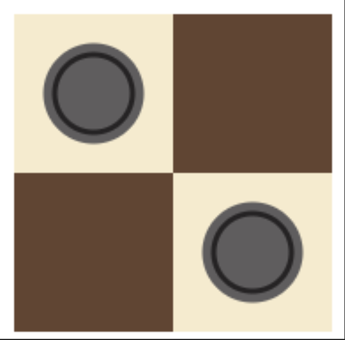

# Chess Board in Pure CSS 🎨

## 📌 Условия
CSS-задача: сверстать шахматную доску и шашки, используя только один HTML-элемент `
` и чистый CSS.
Использовать картинки (даже через data:uri) нельзя.

Размеры:
Общая ширина: 180px
Общая высота: 180px
Размер секции 90 на 90px

Цвета:
Темная секция: #654430
Светлая секция: #f7ebcc

Шашка:
Основной цвет #5f5d5e
Обводка #252324
Диаметр внутренний круг 40px
Черная обводка 3px
Серая обводка 5px

## 🖼️ Скриншот

## ✨ Использованные техники
- `conic-gradient` для шахматного узора.
- `::before` и `::after` для шашек.
- `box-shadow` для обводки.

## 🔗 Демо
(Здесь будет ссылка на GitHub Pages)

## 📌 Источник
https://coderun.yandex.ru